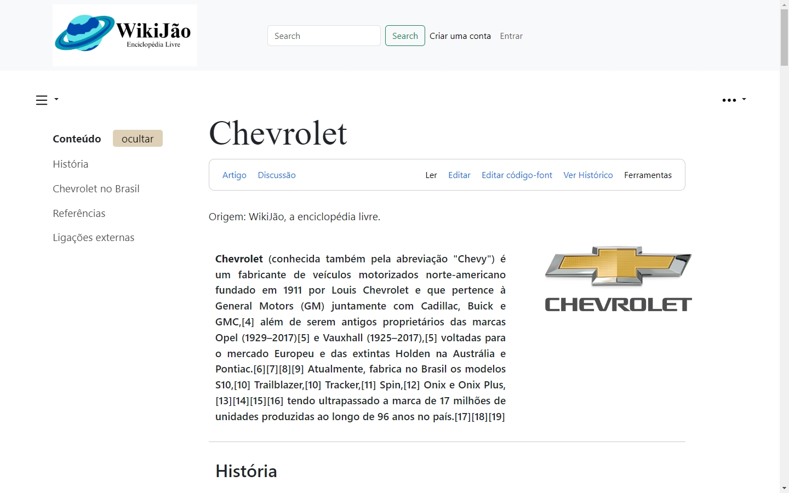
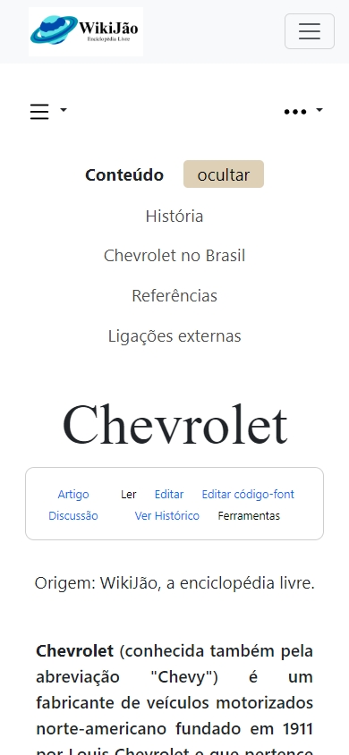
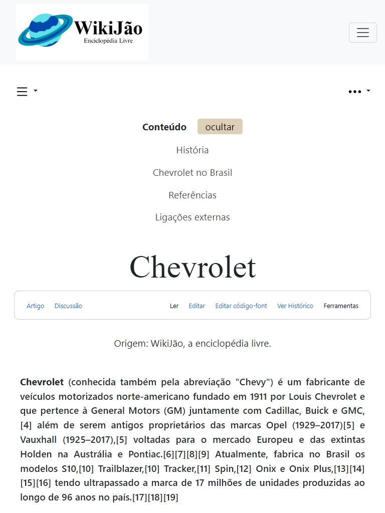

# Wikijão

## Descrição
Projeto desenvolvido para o último desafio da Formação HTML da DIO , a proposta era construir uma página semelhante a uma aba da Wikipedia

## Tecnologias
- Html
- Css
- Bootstrap

## Design Responsivo
Procuro sempre desenvolver um design responsivo mesmo em pequenos projetos

### Mobile

